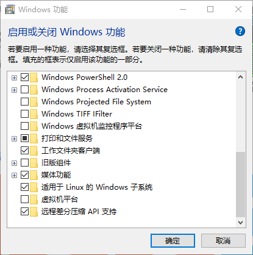
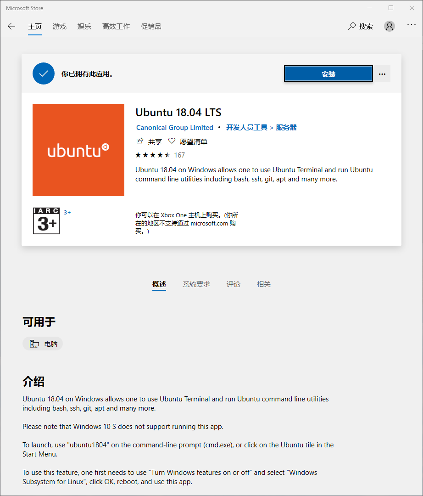
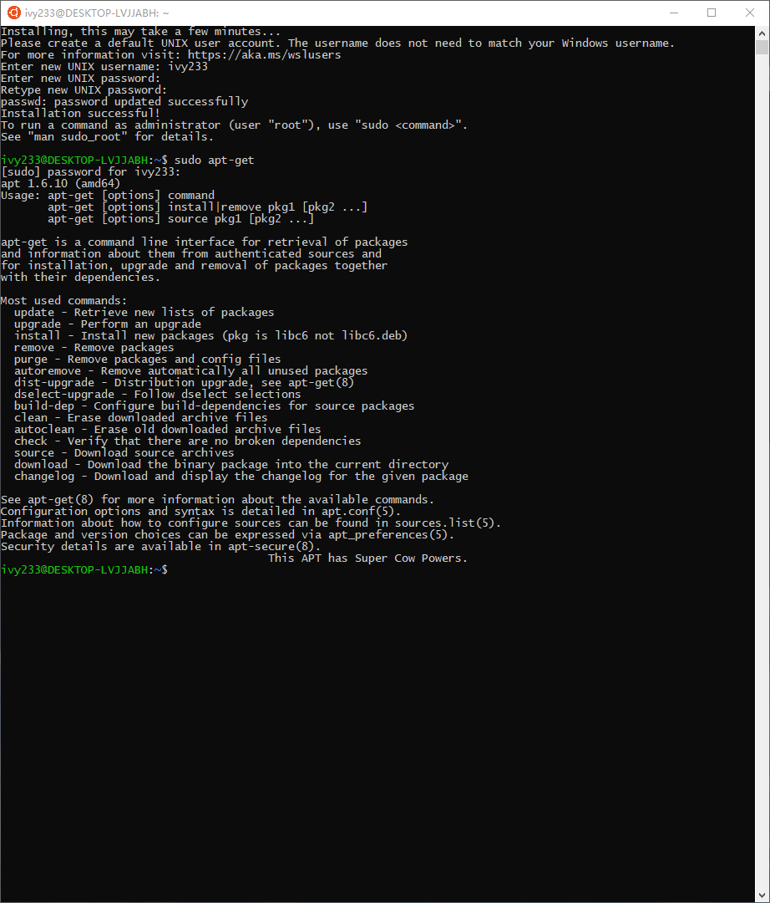
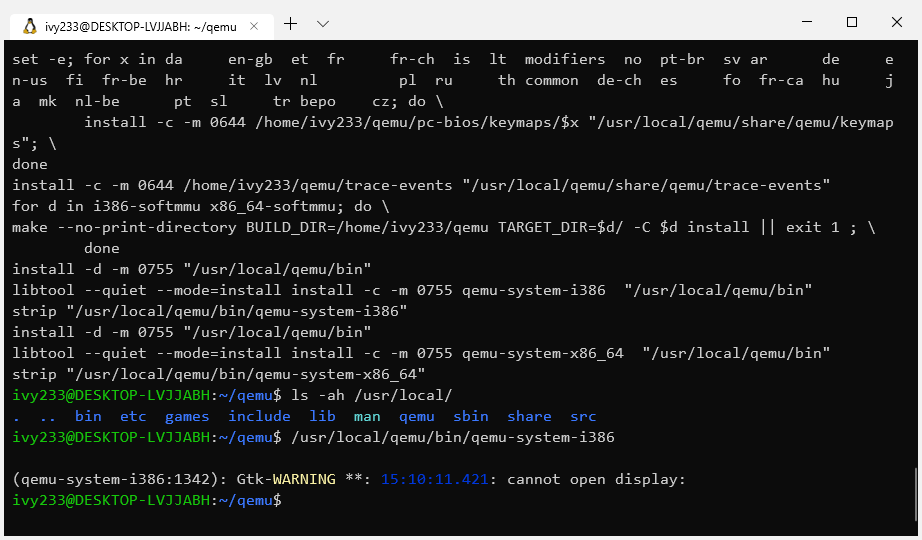
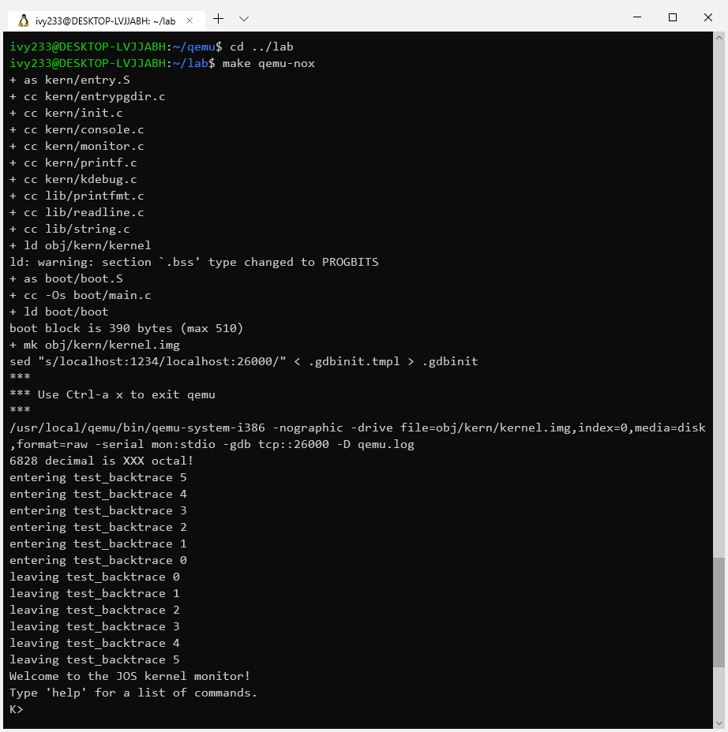
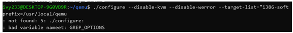

# Lab 0

## 前言

由于使用了wsl(windows subsystem for linux，即适用于windows的linux子系统)来配置环境，这种环境可能是大多数人没使用过的，而且wsl1只是使用windows NT实现的linux内核，通过pipe转发linux命令到windows来完成命令实现并方便交互。

除此以外，MIT 6.828使用qemu虚拟机，但是是专门定制的，所以需要去MIT-pdos的github账户下下载或者git同步，而且配置会相对比较花费时间，容易出现奇怪的bug。

综合上述两个原因，专门花费一章来讲述wsl配置和qemu的安装，顺便暗示一下这个Lab中的Lab。自然地，Lab1中也不再讲述这部分内容。

## Windows子系统的配置

Windows子系统是win10在1703之后的版本，具体配置可以在[微软官网](https://docs.microsoft.com/zh-cn/windows/wsl/install-win10)找到，这里讲述一下个人的配置过程。

### 安装wsl



这个功能也可以使用管理员下的Powershell完成。

```powershell
Enable-WindowsOptionalFeature -Online -FeatureName Microsoft-Windows-Subsystem-Linux
```

但是不论使用哪种方式，都需要重启系统已完成最终的功能配置。然后在Windows商店搜索，下载并安装Ubuntu-18.04 LTS。



单击这个装好的应用，就可以打开终端，这个相当于安装系统的功能。安装需要一段时间，之后输入账号密码就可以使用了，由于是本地系统，所以设置简单密码也不会被攻击。如果跳过第一步，你会收到一条消息，让你回去把那个打开在来打开这个应用。

下面是安装完成的截图。



### 配置wsl

和Ubuntu一样，内置的是ubuntu自带软件源，由于下载特别慢，所以需要换源（如果你足够牛皮，可以考虑配置apt代理）。

除此以外，由于windows另外一个开源工具Terminal特别好用，笔者选用此终端完成剩下的内容，如果不想用的话，也可以使用原来的应用。

命令如下：

```shell
sudo vi /etc/apt/sources.list
```

然后把这个换成比较著名的国内源即可，如果不知道的可以按照[这个](https://os.vampire.rip/speedup.html)来配置。之后和Ubuntu一样更新软件。

```sh
sudo apt-get update
sudo apt-get upgrade
```

### MIT 6.828 环境配置

如果你直接开始看这里，推荐回头看看wsl的配置。

#### 安装依赖

用这个命令安装qemu需要的以来。原教程有libsdl-dev，这个主要用于产生qemu的界面。Git工具一般wsl会自带，这里也带上。

```shell
sudo apt-get install git build-essential binutils g++-multilib libgtk2.0-dev libtool-bin
```

#### 安装qemu

这一步可以和第一步同时进行。使用这个命令来获得qemu的的最新包。这一步将会花费比较多的时间。

```shell
git clone https://github.com/mit-pdos/6.828-qemu.git qemu
```

但是一般速度很慢，建议配置代理。

```shell
git config --global https.proxy socks://127.0.0.1:1080
git config –global http.proxy socks://127.0.0.1:1080
```

不过千万要注意的是：不能再/mnt目录下完成。如果在VMWare下，不能在/mnt/hgfs中完成。下载完成之后需要make一下。

```shell
cd qemu
./configure --disable-kvm --disable-werror --target-list="i386-softmmu x86_64-softmmu" --prefix=/usr/local/qemu
sudo make
sudo make install
```

#### 进入lab虚拟机

在进入系统之前，需要使用git同步lab：

```shell
git clone https://pdos.csail.mit.edu/6.828/2018/jos.git lab
```

然后打开lab/conf/env.mk，修改最后一行的qemu目录，需要和之前的匹配。


到这一步之前都可以同步执行，甚至按照教程来的话有可能第三步首先执行完成。之后输入

```shell
cd lab
make qemu-nox
```

可以看到这个界面时，配置完成。啥都没有是正常的，因为wsl确实没有显示输出，需要安装XShell才有，因此这里选择qemu-nox，而不是教程所说的qemu。





### 可能遇到的问题

关于大部分遇到的问题，网上都有解答，甚至有网页专门写了网页来解答。但是我在配置的时候遇到了一个网上搜不到的问题。



如果遇到了这个问题，请重装windows 10。我试过给环境变量加上GREP_OPTIONS，注释那一行，重置wsl，重置wsl功能，都是无效的。

在写本文的时候出现了一个新的问题：内容没有截下来，具体表现为没有这个命令，然后看一下文件夹分布

```shell
/mnt/c/Users/95225$ cd ~
~$ ls -ah
.   .bash_history  .bashrc     .profile                   .viminfo  qemu 
..  .bash_logout   .gitconfig  .sudo_as_admin_successful  lab
~$ ls -ah /usr
.  ..  bin  games  include  lib  lib32  libx32  local  sbin  share  src
~$ ls -ah /usr/local/
.  ..  bin  etc  games  include  lib  man  sbin  share  src
~$ ls -ah /usr/local/bin
.  ..
```

解决方法就是把第三步重新做一遍。

## 小结

Windwos下的wsl是相当好用的工具，在windows上提供了和linux命令行一样的体验，同时保持了小体积和系统级多开(微软商店提供了Ubuntu和Ubuntu18.04，Ubuntu16.04三个版本)，提供了很多的便利。

与此同时，qemu的配置比较复杂，完成这一部分本身就可以写一份比较复杂的实验报告了，本身也是很有成就感的。

不过不要忘了，这里只是第一步，虽然千里之行始于足下，但是这条路并不如想象中平坦。