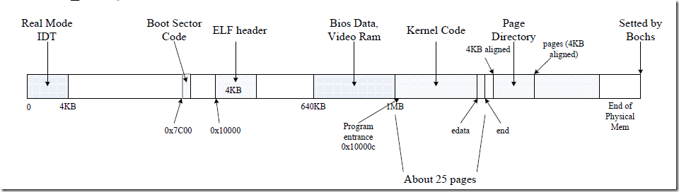
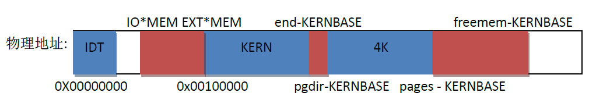
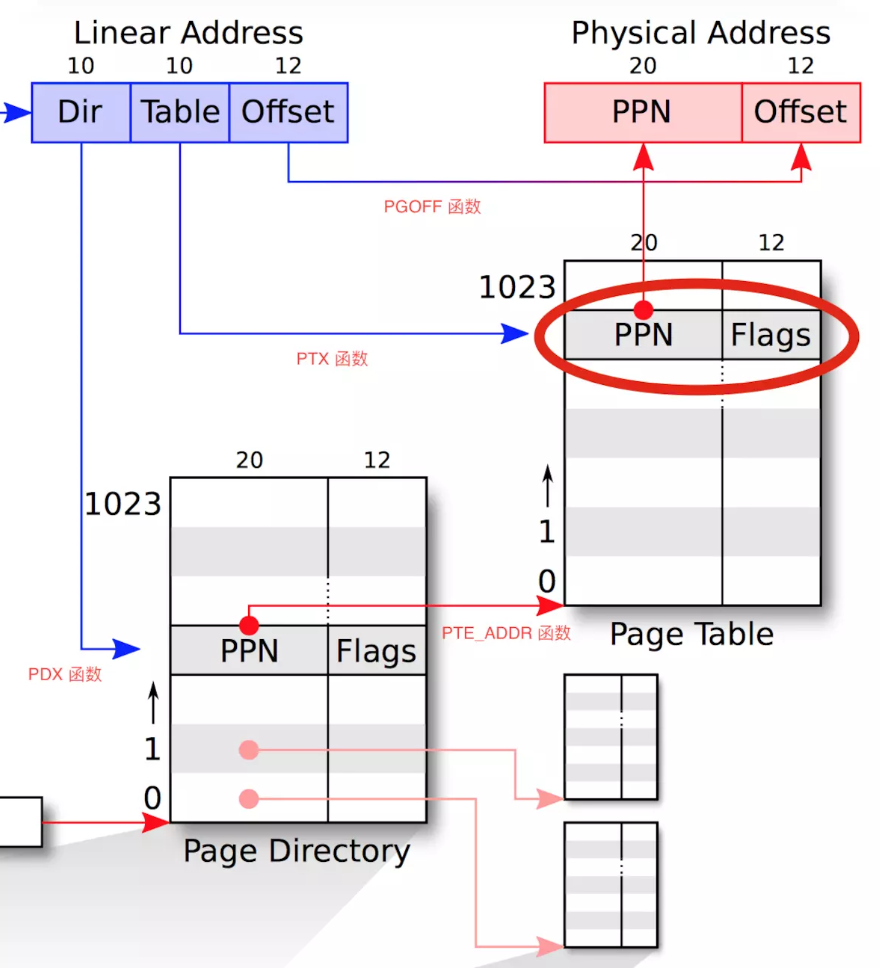

# Lab2

## 前言

Lab1主要负责的是研究系统启动，侧重于kernel的堆栈分析。其中Lab1只有一个很简单的页表，做完了以后物理内存大概长这个样子：



但是Lab2的主要任务是在这段内存上做一个管理。其中的内存管理指的是物理内存和虚拟内存。所谓的物理内存就是在物理地址上分配一系列页表的内存，就像这样。



所谓的虚拟内存就是在其中建立一些映射，当然在有比较大型的链表之后需要有一系列的操作来满足要求。

其中在合并之后多出了几个文件：`inc/memlayout.h`，`kern/kclock.h`, `kern/kclock.c`, `kern/pmap.h`, `kern/pmap.c`。本实验主要对其做一些文件扩充。本实验增加新的`cprintf`不会影响`make grade`的评分。

## Lab2的Exercise1

### 问题

实现`kern/pmap.c`中`boot_alloc()`, `mem_init()`, `page_init()`, `page_alloc()`, `page_free()`的代码。

`check_page_free_list()` 和 `check_page_alloc()` 会测试你的物理页面分配器。你应该启动 JOS 并查看 `check_page_alloc()` 是否报告成功。修改代码，并确定能够通过它的测试。你可以添加自己的 `assert()` 来验证你的假设是否正确。

### 前置知识

1. JOS的内存分布，这个在`memlayout.h`里面是没有的，图片已经在最前面给出来了。从这里可以看出一些东西，也可以称作额外的提示。

   一个是系统打算按照页的方式来分配内存，一页大小4KB，即`0x1000`B，这正好和CPU的虚拟地址对应上了，这是一处伏笔。

   注意这个IO hole，后面有戏份。

   如果进行内核观察，可以发现内核的`end`和`.bss`的最后是有关系的。

   根据上一个lab的说法，我们已经把`0xf0000000`映射到`0x00000000`了，大小是256M，但是根据实验的结果来看，我不认为是这个大小。

   如果不知道为什么的，甚至看到这里还是不懂的话，建议`cprintf`大法。

2. 可以通过`read_ebp()`发送asm来读取`$ebp`寄存器的内容。

### 解答

首先从`i386_init()`开始，这个函数在`kern/init.c`里面。可以看出在控制台初始化之后内存就初始化了，这个时候进入`mem_init()`查看内容，发现非常长，实际上这就是`pmap.c`中的主函数，我们需要实现其中的每一个部分。

```C
void i386_init(void)
{
    extern char edata[], end[];
    // 这里首先把bss清空了
    // 这样分配出来的全局变量都是0
    memset(edata, 0, end - edata);
    cons_init();
    // cprintf("edata = %x, end = %x\n", edata, end);
    cprintf("6828 decimal is %o octal!\n", 6828);
    // Lab2我们要做的都在这里
    mem_init();
    while (1)
        monitor(NULL);
}
```

进去以后可以发现第一个函数`i386_detect_memory()`，可以发现一个函数长相很奇怪，追踪到最后可以看到这些：（`kern/kclock.c`是函数实现，`kern/kclock.c`有变量的定义）。

```C
#define IO_RTC 0x070
unsigned mc146818_read(unsigned reg)
{
    outb(IO_RTC, reg);
    return inb(IO_RTC+1);
}
void mc146818_write(unsigned reg, unsigned datum)
{
    outb(IO_RTC, reg);
    outb(IO_RTC+1, datum);
}
```

硬件大法好！这里读取出来的数据我做了个记录，大致如下：

```
basemem = 280, extmem = ffff, ext16mem = 1c000
totalmem = 20000, npages = 8000, npages_basemem = a0
```

注意这里的`npages`和`npages_basemem`，戏份非常多。

紧接着就发现了调用了`boot_alloc()`，目的是为了分配第一块内存，具体目的实际上是页目录表，每项占据8bits，一共`0x8000`项。

进入`boot_alloc()`，发现`nextfree`标记了有哪些内存是可以紧接着分配的，但是一开始肯定是不知道在哪里的。根据注释可以找到这个`end`具体对应的是`bss`的最后一个字节，之后通过ROUNDUP来对齐4KB。

```C
// 如果是第一次使用，需要初始化nextfree。
// end是一个魔术常量，由链接器进行自动提供其值，指向bss的最后。
// 链接器未分配给任何内核代码或全局变量的第一个虚拟地址。
if (!nextfree)
{
    extern char end[];
    nextfree = ROUNDUP((char *)end, PGSIZE);
}
```

```
  9 .bss          00000674  f0116060  00116060  00017060  2**5
                  CONTENTS, ALLOC, LOAD, DATA
```

由于根据大块的要求，这里只是实现一个物理内存分配器，但是没有`malloc`，因此限制就少了很多。

```C
// LAB 2: Your code here.
// 对于0进行特判
if (n == 0) {
    return nextfree;
}
// 其他情况自由分配，反正没有malloc
result = nextfree;
nextfree += ROUNDUP(n, PGSIZE);
return result;
```

接下来要填充的内容之前还有一行代码，读懂这里就需要注意`inc/mmu.h`的很多东西，通过`cprintf`可以直接拿出我们想要的值，不过看上去似乎没啥大用，或者至少要花点时间算算，查一下资料才能知道在干啥。但是这里是一个隐性的映射。

```c
// Recursively insert PD in itself as a page table, to form
// a virtual page table at virtual address UVPT.
// (For now, you don't have understand the greater purpose of the
// following line.)
// Permissions: kernel R, user R
// #define PDXSHIFT    22
// #define PDX(la)     ((((uintptr_t) (la)) >> PDXSHIFT) & 0x3FF)
kern_pgdir[PDX(UVPT)] = PADDR(kern_pgdir) | PTE_U | PTE_P;
```

接下来就是补全自身缺少的代码了。根据之前的提示，这里给出代码其实不算困难，`pages`代表页表项的数组，需要`npages`个，然后清0就行。

```c
pages = (struct PageInfo *)boot_alloc(npages * sizeof(struct PageInfo)); // 分配页标记
memset(pages, 0, npages * sizeof(struct PageInfo));                      //清空
// PageInfo
struct PageInfo {
    struct PageInfo *pp_link; //下一个位置
    uint16_t pp_ref;           //引用次数
};
```

再接下来就是`page_init()`这个函数。这里先给出实现，对照一开始给出的表格看看能不能理解。说白了这就是对物理页的分页和初始化操作。

```c
#define PADDR(kva) _paddr(__FILE__, __LINE__, kva)
static inline physaddr_t _paddr(const char *file, int line, void *kva)
{
    if ((uint32_t)kva < KERNBASE)
        _panic(file, line, "PADDR called with invalid kva %08lx", kva);
    return (physaddr_t)kva - KERNBASE;
}

void page_init(void)
{
    size_t i;
    page_free_list = NULL;
    // 1) 这里是实模式的位置
    // 有多少人还记得这玩意是直接用导线连接的吗？
    pages[0].pp_ref = 1;
    // 2) 这里是到IOhole为止
    for (i = 1; i < npages_basemem; i++)
    {
        pages[i].pp_ref = 0;
        pages[i].pp_link = page_free_list;
        page_free_list = &pages[i];
    }
    // 3) IOhole直接避开
    // 这里还包括了IOhole往上走到页表占用的空间
    size_t first_free_address = PADDR(boot_alloc(0));
    // #define IOPHYSMEM 0x0A0000
    // #define EXTPHYSMEM 0x100000
    for (i = IOPHYSMEM / PGSIZE; i < first_free_address / PGSIZE; i++)
        pages[i].pp_ref = 1;
    // 4) 到头就行
    for (i = first_free_address / PGSIZE; i < npages; i++)
    {
        pages[i].pp_ref = 0;
        pages[i].pp_link = page_free_list;
        page_free_list = &pages[i];
    }
}
```

如果说你不能理解的话，看看后面的内容说不定能理解一点。

拿到了`npages`个页表，剩下的就是重置页表的属性，由于是32位系统，最大内存4GB，所以用32位的指针是允许的（现在的系统大多数是64位）。一般情况下我们会把所有的页表穿成一个页表，如果被拿走了就被实际赋上了值。

根据提示可以看到的是有些地方需要跳过去，并且明确指出在IO hole和IO hole后面的一部分需要被标记为不可分配，对应的区域在之前就给出来了：从IO hole以知道`PageInfo`的最后一项。其他的正常赋值就可以了。

不过需要注意一点的是，如果加入了调试可以看出来，`pages`的数组内存地址和预想的不太一样，实际上`pages`只有`0x8000`项，算下来内存只有128MB，但是要求却有256MB，因此这里需要继续验证一下。

除此以外，在调试信息还可以看出来的是，链表的顺序是`pages[n-1]->…->page[1]`倒着来的，这里其实怎么分配都无所谓，只要能过测试就行。啊还有一点，这里的页表实际上用了类似于bitmap的思想，来获得空间压缩。

接着就是`page_alloc`和`page_free`了。函数`page_alloc`就是返回一个当前空闲的物理页，并且进行一些适当的处理。函数`page_free`是为了回收，并且要求引用数为0，`pp_link`一定为空，前者是为了防止拿走别人占用的，后者是为了防止多次回收空页。

```c
#define KADDR(pa) _kaddr(__FILE__, __LINE__, pa)
static inline struct PageInfo* pa2page(physaddr_t pa)
{
    if (PGNUM(pa) >= npages)
        panic("pa2page called with invalid pa");
    return &pages[PGNUM(pa)];
}
static inline void* page2kva(struct PageInfo *pp)
{
    return KADDR(page2pa(pp));
}

struct PageInfo *page_alloc(int alloc_flags)
{
    // 页表为空则返回错误
    if (page_free_list == NULL)
        return NULL;
    // 拿出一个新的页面，具体分配方式和STL好像
    struct PageInfo *new_page = page_free_list;
    page_free_list = page_free_list->pp_link;
    new_page->pp_link = NULL;
    // 是否清空
    // ALLOC_ZERO = 1
    if (alloc_flags & ALLOC_ZERO)
        memset(page2kva(new_page), '\0', PGSIZE);
    return new_page;
    // 页表为空则返回错误
    if (page_free_list == NULL)
        return NULL;
    // 拿出一个新的页面，具体分配方式和STL好像
    struct PageInfo *new_page = page_free_list;
    page_free_list = page_free_list->pp_link;
    new_page->pp_link = NULL;
    // 是否清空
    if (alloc_flags & ALLOC_ZERO)
        memset(page2kva(new_page), '\0', PGSIZE);
    return new_page;
}
void page_free(struct PageInfo *pp)
{
    // 多次回收和不该回收的时候回收了
    if (pp->pp_ref > 0 || pp->pp_link != NULL)
    {
        panic("Double check failed when dealloc page");
        return;
    }
    pp->pp_link = page_free_list;
    page_free_list = pp;
}
```

运行完了之后进行测试，可以得到这样的结果。

```
6828 decimal is 15254 octal!
basemem = 280, extmem = ffff, ext16mem = 1c000
totalmem = 20000, npages = 8000, npages_basemem = a0
Physical memory: 131072K available, base = 640K, extended = 130432K
check_page_free_list() succeeded!
check_page_alloc() succeeded!
kernel panic at kern/pmap.c:724: assertion failed: page_insert(kern_pgdir, pp1, 0x0, PTE_W) < 0
Welcome to the JOS kernel monitor!
Type 'help' for a list of commands.
```

遇到了错误是正常的，因为724行遇到的是`check_page`函数，检查的是`page_insert`和`page_remove`，我们还没有涉及到。

### 引出的问题

这里的问题同样有可能会花费很多时间来处理，也有可能非常简单。这里JOS分配了`0x8000`个`npages`，是不是意味着只能管理128M的内存？

## Lab2的question1

### 问题

实现假设下面的JOS内核代码没有问题，那么x是什么类型？是`uintptr_t`还是`physaddr_t`？

```c
mystery_t x;
char *value = return_a_pointer();
*value = 10;
x = (mystery_t)value;
```

### 解答

很显然是`uintptr_t`。因为C语言定义的一定是虚拟地址。而且这里没有从虚拟地址跳转回物理地址的位置，因此答案只能是虚拟地址。

理地址的位置，因此答案只能是虚拟地址。

## Lab2的exercise4

### 问题

实现`kern/pmap.c`中的函数`pgdir_work()`, `boot_map_region()`, `page_lookup()`, `page_insert()`, `page_remove()`的代码。用`check_page()`检测是否成功。

### 前置知识

1. 大量的`define`与函数，建议自行去`inc/mmu.h`和`inc/memlayout.h`中查找，如果遇到的话会在代码中列出来的，就像在`page_init`中的一样。

2. 虚拟内存的转换。

   

### 解答

这一题和上一题不一样的是，完全没有入口，所以只能依照注释来完成出题人想要的功能，否则测试就无法通过。既然这样就从`pgdir_walk`开始，因为这个函数是后面实现的支点。

#### 函数`pgdir_walk`

这个函数要求的输入是页目录入口，一个虚拟地址和一个设置位，设置位如果位1却不存在的时候自动创建，如果能查找到返回页表项的指针，其他情况返回`NULL`。涉及到页表地址也就是说，后续可以直接对页表进行修改，也返回对应的内容。

于是这样就可以知道这个函数有三个东西要考虑：第一是如果这个东西存在，直接返回；第二是如果不存在而且不要求创建，那么就返回空；第三是如果要求创建，那么分配一个位置以后直接返回。

这里一定要注意的是，代码中操作的都是虚拟地址，但是页表目录和页表中返回的都是物理地址。

```c
pte_t *pgdir_walk(pde_t *pgdir, const void *va, int create)
{
    // 输入：页目录pgdir，虚拟地址va，设置位create
    // 输出：页表对应指针
    // #define PDX(la) ((((uintptr_t) (la)) >> 22) & 0x3FF)
    // #define PTX(la) ((((uintptr_t) (la)) >> 12) & 0x3FF)
    uint32_t pgdir_idx = PDX(va); // 页目录中的偏移
    uint32_t pgtab_idx = PTX(va); // 页项中的便宜
    pte_t *pgtab;
    // 如果在页目录中存在
    // #define PTE_ADDR(pte)   ((physaddr_t) (pte) & ~0xFFF)
    // #define KADDR(pa) _kaddr(__FILE__, __LINE__, pa)
    if (pgdir[pgdir_idx] & PTE_P)
        pgtab = KADDR(PTE_ADDR(pgdir[pgdir_idx]));
    else {
        // 如果要求没有则创建
        if (create) {
            // 注意page_alloc并不新增引用
            struct PageInfo *new_page = page_alloc(ALLOC_ZERO);
            if (new_page) {
                new_page->pp_ref += 1; // 肯定有引用
                pgtab = (pte_t *)page2kva(new_page);
                pgdir[pgdir_idx] = PADDR(pgtab)|PTE_P | PTE_W | PTE_U;
            }
            else return NULL;
        }
        // 反之就啥都查不到了
        else return NULL;
    }
    return &pgtab[pgtab_idx];
}
```

而且如果进行调试的话，可以发现有这样的输出，可以得到这样的结论：第一，页表的存储内容实际上是4K对齐的，最低3bits存储的是权限；第二，页表项的分配是倒序来的，也就是说是n-1到n-2这个方向；第三，之前的测试占据了一些页表项。

```
va = 0, PDX(va) = 0, pgdir[PDX(va)] = 0, create = 0
va = 0, PDX(va) = 0, pgdir[PDX(va)] = 0, create = 1
case3: we need a new one at 0
va = 0, PDX(va) = 0, pgdir[PDX(va)] = 0, create = 1
case3: we need a new one at f011cff8
va = 1000, PDX(va) = 0, pgdir[PDX(va)] = 3ff003, create = 1
case 1: pg_table_p = f03ff000, result = f03ff004
...还有很多
```

#### 函数`boot_map_region`

第一个函数确实比较困难，这个就简单很多了，就是循环`pgdir_walk()`。

```c
static void boot_map_region 
    (pde_t *pgdir, uintptr_t va, size_t size, physaddr_t pa, int perm)
{
    pte_t *pgtab;
    // #define PGNUM(la) (((uintptr_t) (la)) >> 12)
    size_t pg_num = PGNUM(size);
    // cprintf("map region size = %d, %d pages\n", size, pg_num);
    for (size_t i = 0; i < pg_num; i++, va += PGSIZE, pa += PGSIZE)
    {
        pgtab = pgdir_walk(pgdir, (void *)va, 1); // 在页表中的哪里
        if (!pgtab)
            return;
        *pgtab = pa | perm | PTE_P; // 重新设定权限
    }
}
```

#### 函数`page_lookup`

第一个函数返回的是页的指针，那这个就要返回这一页是否合法。只不过形式上还是依葫芦画瓢。当然，要可以拿出来。

```c
// kern/pmap.h
static inline struct PageInfo *pa2page(physaddr_t pa)
{
    if (PGNUM(pa) >= npages)
        panic("pa2page called with invalid pa");
    return &pages[PGNUM(pa)];
}
struct PageInfo *page_lookup(pde_t *pgdir, void *va, pte_t **pte_store)
{
    pte_t *pgtab = pgdir_walk(pgdir, va, 0); // 不创建，只查找
    if (!pgtab)
        return NULL; // 未找到则返回 NULL
    if (pte_store)
        *pte_store = pgtab;           // 附加保存一个指向找到的页表的指针
    // #define PTE_ADDR(pte) ((physaddr_t) (pte) & ~0xFFF)
    return pa2page(PTE_ADDR(*pgtab)); //  返回页面描述
}

```

#### 函数`page_insert`

本函数顾名思义就是建立映射，输入就是页表入口，页描述结构体指针，线性地址，权限设置。和`boot_map_region`一样可以直接通过指针修改权限内容。

```c
int page_insert(pde_t *pgdir, struct PageInfo *pp, void *va, int perm)
{
    // 如果没有则需要创建
    pte_t *pgtab = pgdir_walk(pgdir, va, 1);
    if (!pgtab)
        return -E_NO_MEM;
    pp->pp_ref++;
    // 如果已经存在
    if (*pgtab & PTE_P)
        page_remove(pgdir, va);
    *pgtab = page2pa(pp) | perm | PTE_P;
    return 0;
}
```

#### 函数`page_remove`

再接下来就是`page_remove`，传入参数就是页表地址和虚拟地址。这个时候注意提示，操作系统不光光有页表需要维护。同样这里可以看到的是`page_lookup`的第三参数的取出用途了。

```c
void page_decref(struct PageInfo *pp)
{
    if (--pp->pp_ref == 0)
        page_free(pp);
}
void page_remove(pde_t *pgdir, void *va)
{
    // Fill this function in
    pte_t *pgtab;
    pte_t **pte_store = &pgtab;
    struct PageInfo *pInfo = page_lookup(pgdir, va, pte_store);
    if (!pInfo)
        return;
    page_decref(pInfo);
    tlb_invalidate(pgdir, va); // 通知tlb失效。
    *pgtab = 0;                // 清空，防止无意的读取。
}
```

最后检测一下，可以得到这样的结果：

```
Physical memory: 131072K available, base = 640K, extended = 130432K
IOPHYSMEM/PGSIZE = a0, EXTPHYSMEM/PGSIZE = 100, first_free_address = 15b000, npages = 8000, page_free_list = f015aff8, pages = f011b000
check_page_free_list() succeeded!
check_page_alloc() succeeded!
check_page() succeeded!
kernel panic at kern/pmap.c:716: assertion failed: check_va2pa(pgdir, UPAGES + i) == PADDR(pages) + i
```

因为实验没有结束，所以吃`panic`还是很正常。

## Lab2的exercise5

### 问题

实现`kern/pmap.c`中`mem_init()`的代码。

现在，你要设置地址空间在 `UTOP` 以上的部分：内核部分的地址空间。`inc/memlayout.h` 文件中展示了我们使用的内存地址空间的布局，你将使用你写的函数去建立线性地址到物理地址映射，以建立这个布局。

用`check_kern_pgdir()`和`check_page_installed_pgdir()`检测。

### 前置知识

1. JOS的内存分布图，这在`inc/memlayout.h`中可以看到。

   ```c
   *                     |~~~~~~~~~~~~~~~~~~~~~~~~~~~~~~| RW/--
   *                     |                              | RW/--
   *                     |   Remapped Physical Memory   | RW/--
   *                     |                              | RW/--
   *    KERNBASE, ---->  +------------------------------+ 0xf0000000
   *    KSTACKTOP        |     CPU0's Kernel Stack      | RW/-- KSTKSIZE
   *                     | - - - - - - - - - - - - - - -|
   *                     |      Invalid Memory (*)      | --/--  KSTKGAP
   *                     +------------------------------+
   *                     |     CPU1's Kernel Stack      | RW/--  KSTKSIZE
   *                     | - - - - - - - - - - - - - - -
   *                     |      Invalid Memory (*)      | --/--  KSTKGAP
   *                     +------------------------------
   *                     :              .               :                
   *    MMIOLIM ------>  +------------------------------+ 0xefc00000
   *                     |       Memory-mapped I/O      | RW/--  PTSIZE
   * ULIM, MMIOBASE -->  +------------------------------+ 0xef800000
   *                     |  Cur. Page Table (User R-)   | R-/R-  PTSIZE
   *    UVPT      ---->  +------------------------------+ 0xef400000
   *                     |          RO PAGES            | R-/R-  PTSIZE
   *    UPAGES    ---->  +------------------------------+ 0xef000000
   *                     |           RO ENVS            | R-/R-  PTSIZE
   * UTOP,UENVS ------>  +------------------------------+ 0xeec00000
   * UXSTACKTOP -/       |     User Exception Stack     | RW/RW  PGSIZE
   *                     +------------------------------+ 0xeebff000
   *                     |       Empty Memory (*)       | --/--  PGSIZE
   *    USTACKTOP  --->  +------------------------------+ 0xeebfe000
   *                     |      Normal User Stack       | RW/RW  PGSIZE
   *                     +------------------------------+ 0xeebfd000
   ```

### 解答

这一题需要我们根据给出来的知识建立映射。

注意这一段话。用户对任何超过`ULIM`以上的地址空间是没有任何权限的，而内核可以对这一部分空间进行读写操作。对于在`[UTOP,ULIM]`范围内的地址，用户和内核有这相同的权限：可以读但是不能对这一部分进行写操作。这一地址范围用于将内核中的一些数据结构以只读的方式对用户公开。最后，`UTOP`以下的地址空间是为用户部分使用的，设置这一部分空间的权限位以使用户环境可以自由读写它们。

依葫芦画瓢可以建立这样的映射：

```c
 *    UPAGES    ---->  +------------------------------+ 0xef000000
// 这个是对于页表的映射，从UPAGES映射到页表的物理地址。
// 因为用户可能需要涉及到页表的读取，所以给用户读取的权限。
// 但是对于任何人而言，私自修改页表都可能会引发不可预料的灾难。
// 因为页表应当是一个自洽的结构
boot_map_region(kern_pgdir, (uintptr_t)UPAGES, 
npages * sizeof(struct PageInfo), PADDR(pages), PTE_U | PTE_P);
 	*    KERNBASE, ---->  +------------------------------+ 0xf0000000
 *    KSTACKTOP        |     CPU0's Kernel Stack      | RW/--  KSTKSIZE
 *                     | - - - - - - - - - - - - - - -|
 *                     |      Invalid Memory (*)      | --/--  KSTKGAP
 *                     +------------------------------+
// #define KSTKSIZE (8 * PGSIZE) // size of a kernel stack
boot_map_region(kern_pgdir, (uintptr_t)(KSTACKTOP - KSTKSIZE), 
KSTKSIZE, PADDR(bootstack), PTE_W);
// 正如一开始所说的，把256M内存映射到最底下。
// 一是满足kernel在最上面运行的需要。
// 二是满足物理内存从0开始的需要。
boot_map_region(kern_pgdir, (uintptr_t)KERNBASE, 
    ROUNDUP(0xffffffff - KERNBASE, PGSIZE), 0, PTE_W);
```

最终建立映射以后就是这个效果。


最后通过`make grade`记录成绩，练习就做完了。

```
ivy233@DESKTOP-LVJJABH:~/lab$ make grade
+ mk obj/kern/kernel.img
make[1]: Leaving directory '/home/ivy233/lab'
running JOS: (2.5s)
  Physical page allocator: OK
  Page management: OK
  Kernel page directory: OK
  Page management 2: OK
Score: 70/70
```

## Lab2的其他问题

### 问题2

假设下图描述的是系统的页目录表，哪些条目（行）已经被填充了？它们是怎么样进行地址映射的？它们所指向的位置在哪里？请尽可能完善这张表的内容。

大部分都是根据`inc/memlayout.h`进行的猜测，不保证正确哦。

| Entry | Base Virtual Address | Points to(logically) |
| :---: | :------------------: | :------------------: |
| 1023  |      0xffc00000      |    252~256MB内存     |
|   .   |          .           |          .           |
|  961  |      0xf0400000      |      4-8MB内存       |
|  960  | 0xf0000000(KERNBASE) |     前面4MB内存      |
|  959  | 0xefc00000(MMIOLIM)  | CPUs’ kernel  stack  |
|  958  |   0xef800000(ULIM)   |  Memory-mapped  I/O  |
|  957  |   0xef400000(UVPT)   |    Cur page Table    |
|  956  |  0xef000000(UPAGES)  |       RO PAGES       |
|  955  |   0xeec00000(UTOP)   |       RO ENVS        |
|   .   |          ?           |          ?           |
|   2   |      0x00800000      |          ?           |
|   1   |      0x00400000      |         NULL         |
|   0   |      0x00000000      |     Same as 960      |

### 问题3

和我们已经将内核和用户环境放在同一地址空间内。为什么用户的程序不能读取内核的内存？有什么具体的机制保护内核空间吗？

答：页表可以设置权限位，如果没有`PTE_U`则用户无权限读写。

### 问题4

JOS 操作系统可以支持的最大物理内存是多少？为什么？

答：可以猜测2GB，虽然问题1可能和这个问题的需求不太一样，但是`memlayout.h`肯定是一样的。在这个`memlayout`下，页表项最多4MB，而一个页表项8bits，因此一共有512k个页表项，最大到2GB没有问题。

### 问题5

如果我们的硬件配置了可以支持的最大的物理内存，那么管理内存空间的开销是多少？这一开销是怎样划分的？

答：全部都划分到了`pages`数组里面，当然，还有一个`pagedir`在工作，仔细计算下来，以共1024个info和一个32bits的指针，加起来大约8MB多一点。

### 问题6

再次分析 `kern/entry.S` 和 `kern/entrypgdir.c` 的页表设置的过程，在打开分页之后，`EIP` 依然是一个数字（稍微超过 1MB）。在什么时刻我们才开始在 `KERNBASE` 上运行 `EIP` 的？当我们启动分页并在 `KERNBASE` 上开始运行 EIP 之时，我们能否以低地址的 EIP 继续执行？这个过渡为什么是必须要的？

答：语句`jmp *%eax`即转到`$eax`所存的地址执行，在这里完成了跳转。relocated部分代码主要设置了栈指针以及调用`kern/init.c`。由于在 `kern/entrypgdir.c`中将 0~4MB 和 KERNBASE~KERNBASE+4 MB 的虚拟地址都映射到了0~4MB的物理地址上，因此无论EIP在高位和低位都能执行。必需这么做是因为如果只映射高位地址，那么在开启分页机制的下一条语句就会crash。